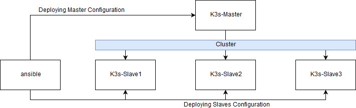

# ansible-k3: Kubernetes Lighweight Cluster with Ansible automation

This is a playbook that allows to install and configure all the nodes in the k3s cluster on Raspberry Pi boards.

This cluster is configuration as follow



This configuration is defined in the inventory/hosts.ini file but without the ansible workstation node.

Hardware Components
-------------
These are the elements I used but any similar components will work.

- Raspberry Pi 3 Model B Plus Rev 1.3
- Samsung 32GB SD
- Anker 60W 10-Port USB Wall Charger, PowerPort 10
- D-Link 5 Port Gigabit Unmanaged Metal Desktop Switch, Plug and Play (DGS-105) 
- Cable Matters 5-Color Combo Cat6 Ethernet Cable
- Mini USB Cable - USB 2.0 A Male to Micro B Sync Charge USB Cord – High Speed Micro USB Charger 
- (Optional) 4 Layers Clear Plate Acrylic Stackable Case for Raspberry Pi 3 Model B+ Case with Fan and Heatsink for Raspberry Pi

SD Flash Tool
------------------
To Flash OS images to SD cards I used [balenaEtcher](https://www.balena.io/etcher/)

Raspbian image
------------------
Downloaded the [Raspbian Lite Latest](https://downloads.raspberrypi.org/raspbian_lite_latest)


Playbook Details
=================
This playbook contains several roles that allows segregation are easy support of the configuration process:

- Download the k3s-binary and deploy it to every node in the cluster
- Changes the configuration hostnames and network configuration applying a static ip address.
- Enables the containers features cpu and memory 
- Disable the swap service
- Run k3s server as systemd service on master nodes
- Run k3s agent join script as systemd service on slave nodes

For more details see the roles README.md files.


Inventory details and example
-----------------
Any pre-requisites that may not be covered by Ansible itself or the role should be mentioned here. For instance, if the role uses the EC2 module, it may be a good idea to mention in this section that the boto package is required.

The inventory contains all the ip address used on my cluster. In anyone is using my ansible playbook should be replace those with the internal network ip space address.

```
k3s-master ansible_host=192.168.0.14
k3s-slave1 ansible_host=192.168.0.13 
k3s-slave2 ansible_host=192.168.0.10 
k3s-slave3 ansible_host=192.168.0.12 

[master]
k3s-master

[slave]
k3s-slave[1:3]

[all:vars]
ansible_connection=ssh
ansible_user=pi
ansible_ssh_pass=raspberry
ansible_ssh_common_args='-o StrictHostKeyChecking=no'
cluster_dns=192.168.0.1 8.8.8.8
cluster_secret=S8p3r53cr3t
```

Playbook example
-------------------
```
---
- hosts: master:slave
  gather_facts: yes
  become: yes
  roles:
    - etc_config
    - container_features
    - dphys_swapfile
    - bootstrap_k3s

- hosts: master
  gather_facts: yes
  become: yes
  roles:
    - { role: k3s_master, tags: ['master'] } 

- hosts: slave
  gather_facts: yes
  become: yes
  roles:
    - { role: k3s_slave, tags: ['slave'] }
```
